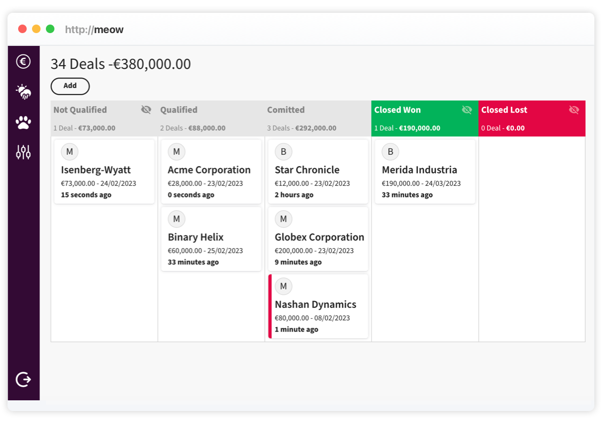

# Meow - Open Sales Funnel

Welcome to the world of free sales funnel management. You can use it setup your sales funnel, opportunities and forecast your sales. Your forecast is automatically update whenever you move the deal down the funnel. Meow was built to simplify your sales process, giving you a bird's eye view of your entire funnel.

Built with [Typescript](https://www.typescriptlang.org/), [React](https://reactjs.org/) and [MongoDB](https://www.mongodb.com/).



## Try It

Do you not have a server? - [Try this ](https://hello.sales-funnel.app/).

## How to Install

This project is written in Typescript and split into two parts, the frontend written in [React](https://reactjs.org/) and the backend based on [Express](https://expressjs.com/) and [TypeORM](https://typeorm.io/). You find the React UI sources in `/frontend`, the server in `/backend`.

### Your own Server - Backend

In order to build the project make sure that you have Node.js v16+ and higher and Git installed.

Clone a copy into your local project directory.

`git clone https://github.com/nash-md/meow.git`

Change the directory to `/backend` and install the dependencies.

`npm install`

Build the project using

`npm run build`

Before you run the build, you’ll need to define the following variables for later use.

- `MONGODB_URI` - pointing to your MongoDB instance.
- `SESSION_SECRET` - a string used to hash the JWT sessons
- `PORT` - server port, if not set the server will use port `9000`
- `LOG_LEVEL` - self-explanatory

Run the project with

`node build/worker.js`

If you want to load environment variables from a file, install dotenv package to handle local environment variables.

`npm install dotenv`

In the root directory create a file called `.env`, then add the following to top of worker.ts

```
import * as dotenv from 'dotenv';

dotenv.config();
```

After the build, you will find the UI in the `/build` directory.

### Frontend

Change the directory to `/frontend` and install the dependencies.

`npm install`

Before building the React frontend, you'll need to set the following variables.

- `REACT_APP_URL` this is the url the frontend will try to connect to, if not set it will try to connect to the backend on the same server on `/public` and `/api`.

This project was built with [Create React App](https://create-react-app.dev/docs/adding-typescript/) without any build modification. You can build it by executing

`npm run build`

You will find the build artifacts in the `build` directory. Host the static files it on the server of your choice.

### License

All files on this GitHub repository are subject to the AGPLv3 license. Please read the License file at the root of the project.
