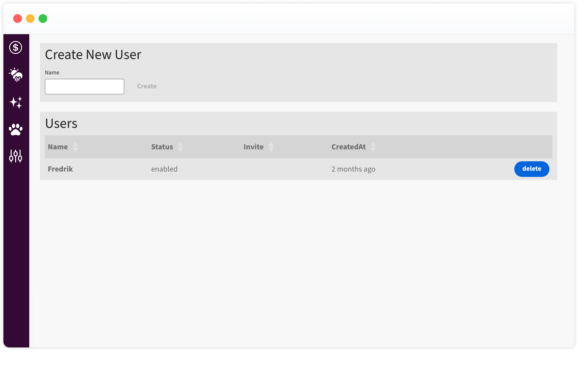
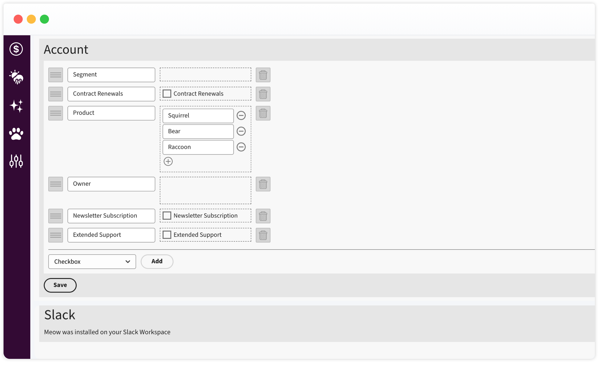

# Step-by-Step Guide - Create Accounts via API

This guide will explain how accounts can be created via POST request to `{your-domain}/api/accounts`.

## Create a System User

If you have not created a system user yet, navigate to `/setup`on your Meow instance. In our example, we will name the user `Website`. This name helps us later to distinguish different sources of leads. Assign a password to your user and keep it safely for later use.



## Create a Schema for your Accounts

Next, let's define a schema for your organisation, this is basically the blue print how your accounts are stored. You can create a schema with multiple data types; 'enums' called dropdown on the UI, 'boolean' flags named Checkbox and 'strings' named Text or Textarea. In our example we will focus on the three 'boolean' you can see on the screen below.



After we saved our schema it is stored as an entity on the database. Before we can create a customer record we need to request the schema keys. On Meow schema attributes are stored with a UUID, this allows us later to rename the names without any dependency.

## Obtain a JWT Token

The project includes a RESTful API and an OpenAPI definition, which can be found in the Meow Open API repository. [Meow Open API](https://github.com/nash-md/meow/blob/main/meow-api.yml). If your setup supports OpenAPI you can easily create requests and data types from the definition.

Before we can communicate with the API, we need to authenticate using our system user. The authentication route is:

`POST {your-domain}/public/login`

Send the following JSON payload

```
{
  "name": "{your-username}",
  "password": "{your-password}"
}
```

The server will respond with a token

```
{
  "token": "{your-jwt-token}",
  "user": {
    "id": "...",
    "name": "Website"
  },
  "account": {
    "id": "...",
    "currency": "..."
  }
}
```

Extract and store the obtained JWT token from the response.

## Request the Schema

We request the schema for the account object and store the key for our attribute. Add the JWT token as a `Token` parameter to the HTTP header. If you're using the OpenAPI specification, the generated code will handle this automatically for you.

`GET {your-domain}/api/schemas?type=account`

The server will send us the schema as a JSON response.

```
[
    {
        "teamId": "....",
        "type": "account",
        "schema": [
            {
                "key": "712f854e-73e1-1bec-cd54-7f920a846574",
                "index": 5,
                "type": "boolean",
                "name": "Newsletter Subscriptionx"
            }
        ]
    }
]
```

Copy the UUID key of the `attributes` you want to set on your customer record.

## Create the Account

With a valid token and the schema attribute keys we can now create our account.

`POST {your-domain}/api/accounts`

o create the account, we will set the `name` and the optional attributes.

```
{
  "name": "Merida Industria",
  "attributes": {
      "712f854e-73e1-1bec-cd54-7f920a846574": true
  }
}
```

If the server responds with a `201` and our account is created.
