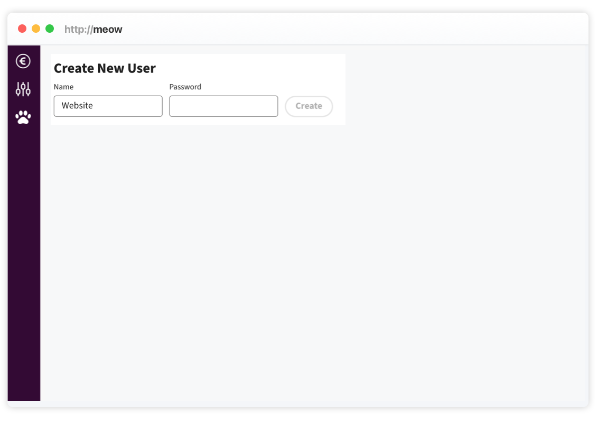
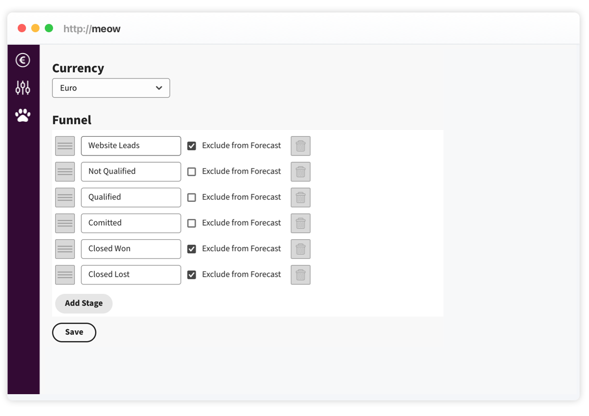
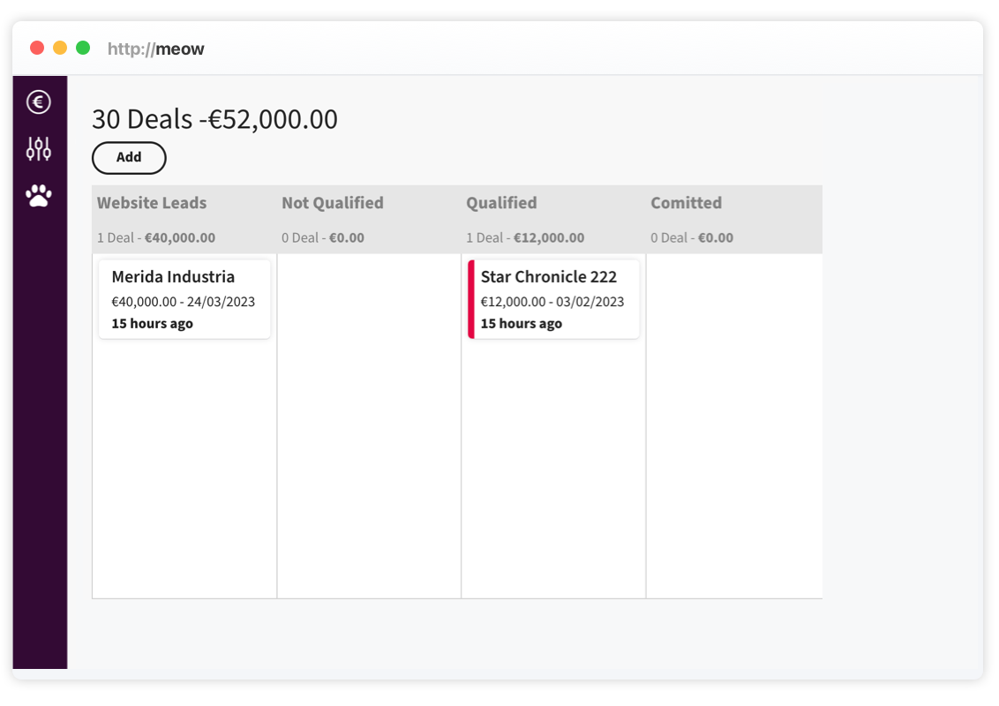

# Step-by-Step Guide - Create Leads via API

This article will explain how leads can be created via POST request to `{your-domain}/api/cards`. In this guide, we'll take you through the steps to setup a system user and create leads via API.

## Create a System User

Open `/setup` on your Meow instance, first, we'll create a system user, in our example we name the user `Website`, this will allow us later to distinguish different sources of leads. Give your user a password and remember it for later use.



## Create a Separate Lead Stage on the Dashboard

We can create a card on any stage, but it's easier to have all inbound leads on a separate lane. In our example we create a `Website Leads` stage.



The setup on Meow is now complete. Now let's write the code to create leads. The project includes a RESTful API and an OpenAPI definition, which can be found in the Meow Open API repository. [Meow Open API](https://github.com/nash-md/meow/blob/main/meow-api.yml). If your setup supports OpenAPI you can easily create requests and data types from the definition.

## Obtain a JWT Token

Before creating a lead, we need to authenticate with our system user. The authentication route is

`POST {your-domain}/public/login`

Send the following JSON payload

```
{
  "name": "Website",
  "password": "{your-password}"
}
```

The server will send us a token back.

```
{
  "token": "{your-jwt-token}",
  "user": {
    "id": "...",
    "name": "Website"
  },
  "account": {
    "id": "...",
    "currency": "..."
  }
}
```

Extract and store the obtained JWT token from the response.

## Create the Lead

With a valid token, we can now create our lead.

`POST {your-domain}/api/cards`

Add the JWT token as `Token` parameter to the HTTP header, if you use OpenAPI specification, the generated code will automatically do it for you.
To create the lead we will set the content and the lane we created before. The API accepts the `laneId` or the `laneName` as a parameter, one or the other has to be in the JSON body. In our case we use the name, nevertheless we need to be careful with this approach if we later want to rename the stage.

```
{
  "name": "Merida Industria",
  "amount": 40000,
  "laneName": "Website Leads"
}
```

If the server responds with a `200` and our lead is created. Now open the dasboard, the card is now shown on the stage you created earlier.


