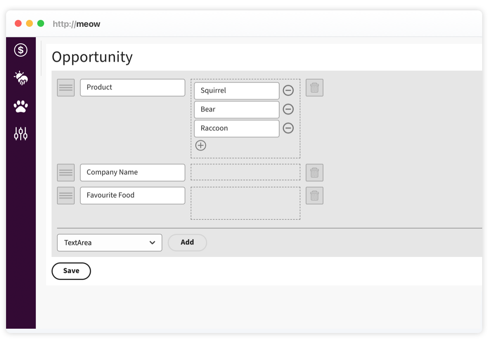
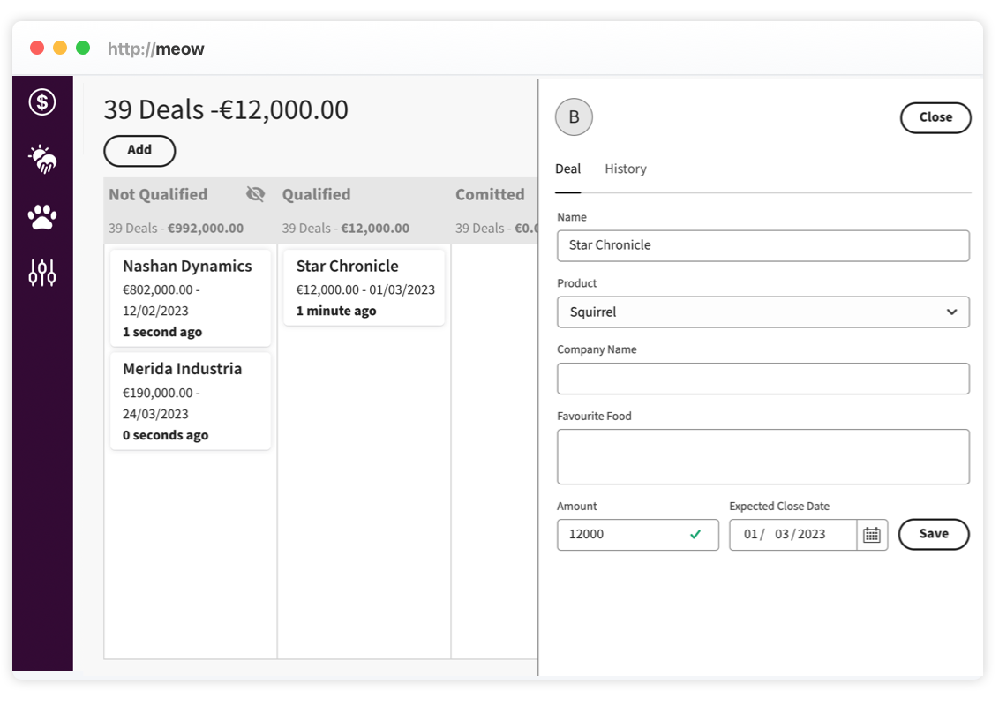

# Step-by-Step Guide - Setup Your Opportunities

This section will explain how to setup the opportunity attributes. Custom attributes can be a powerful tool to store relevant information about a opportunity. By adding custom attributes to an opportunity object, you can capture and track additional information that are important to you.

For example, you could create custom attributes to track information such as the customer's industry, the product the customer is interested in, the phone number, or any other important information that is specific to your sales process. You could also use custom attributes to store notes or other details about the deal that are relevant to the sales team.

By using custom attributes, you can tailor the information captured by the CRM system to your specific needs and make it easier to analyze and report on the data.

## Manage Opportunity Attributes

Open `/setup` on your Meow instance, scoll down to the `Opportunity` section.



You can freely add or remove custom attributes to suit the needs of your organization. There are three different types of attributes available:

- `Textarea` - an area where you can take notes
- `Text` - a text input field
- `Dropdown` - a select menu

You can arrange the order of the attributes by dragging and dropping them on the left side of the list. Once you have made your changes, be sure to press `Save` to persist your setup.



Now head back to your opporunities, the custom attributes you created are displayed together with the `name` and `closed date` of your opportunity.

## Retrieve Opportunities via API

Opportunities are available via API, you can use the API to download and update opportunities with other services you run in your organisation.

## Obtain a JWT Token

Before creating fetch an opportunity, we need to authenticate with our system user. The authentication route is

`POST {your-domain}/public/login`

Send the following JSON payload. If you do not have a user yet, check the [Create Leads via API](docs/create-leads.md) guide for a quick introduction how to create a user.

```
{
  "name": "{my-user}",
  "password": "{your-password}"
}
```

The server will send us a token back.

```
{
  "token": "{your-jwt-token}",
  "user": {
    "id": "...",
    "name": "Website"
  },
  "account": {
    "id": "...",
    "currency": "..."
  }
}
```

Extract and store the obtained JWT token from the response.

## Retrieve an Opportunity via API

With a valid token, we can now fetch the opportunity.

`GET {your-domain}/api/cards/{id}`

Add the JWT token as a `Token` parameter to the HTTP header, if you use OpenAPI specification, the generated code will automatically do it for you. To create the lead we will set the content and the lane we created before.

```
{
  "accountId": "...",
  "user": "...",
  "lane": "...",
  "name": "Star Chronicle",
  "amount": 12000,
  "closedAt": "...",
  "id": "....",
  "attributes": [
    { "keyId": "cea89708-54f9-6383-2839-780555c2dc86", "value": "Squirrel" }
  ],
  "createdAt": "2023-01-09",
  "updatedAt": "2023-01-20"
}
```

If the server responds with a `200` and returns the opportunity.
