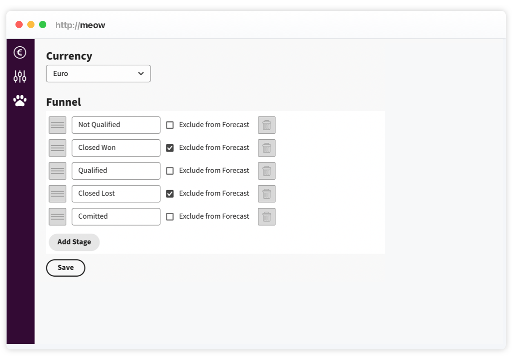

# Step-by-Step Guide - How to Align your Sales Funnel

Tracking the sales funnel is a critical aspect of sales and marketing efforts, and many businesses use it to gauge their success. To optimize your conversions, it's crucial to understand the flow of your sales funnel and the way customers navigate through it. This is where sales pipeline activity can prove valuable. To increase your chances of more conversions, setting up your stages is curcial to your business.

In this guide, we'll take you through the steps to construct a successful sales funnel for your prospects.

Open `/setup` on your Meow instance,

The sales pipeline is usually closely linked to the customer journey. The stages outlines the progression that prospects undergo, for instance `New Leads => Qualification => Proposal => Negotiation => Closed Won`.

Meow comes with a defined set of stages, you can create new stages and change the order with drag and drag'n'drop, please be aware if you delete a stage and press `save` the deals on this stage are gone.
